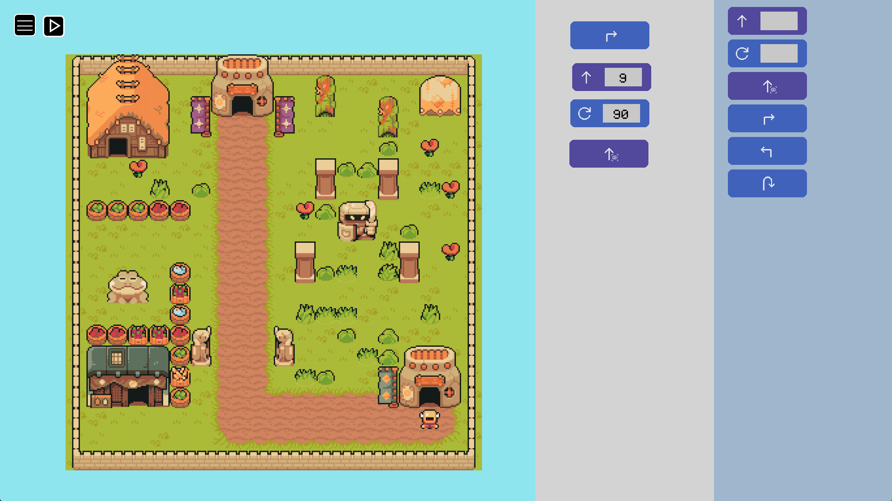
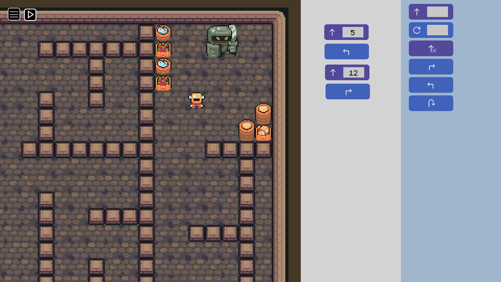

# Mazeborg

Mazeborg is a videogame intended to teach the basics of programming to children.
The game is about using blocks of code to give instructions to a cyborg and help him escape from a maze.

The game features graphics from the [Ninja Adventure](https://pixel-boy.itch.io/ninja-adventure-asset-pack) asset pack made by [Pixel-Boy](https://twitter.com/2Pblog1) and [AAA](https://www.instagram.com/challenger.aaa/?hl=fr), and music produced by [joshuu](https://joshuuu.itch.io/short-loopable-background-music).

## Running the game

**Note:** To run the game you will need to have Python installed.

First download this [repository](https://github.com/FerGem33/Mazeborg/archive/refs/heads/main.zip) and unzip it, or clone it to your machine:

`git clone https://github.com/FerGem33/Mazeborg.git`

Then install the required dependencies:

`pip install -r "requirements.txt`

Once all is set up, just run manually the file `src/main.py` or run the following command:

`python src/main.py`
